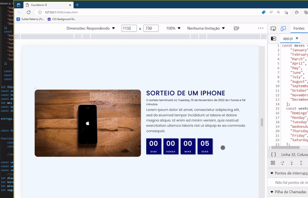

Countdown project made with vanilla JS 
This project is part of a Jhon Smilga course where he teaches basic projects in vanilla JS
The page will always start by adding 10 days from the momment it's opened, updating weekdays and months aswell. 
  

  
<em>Contagem regressiva feito com JS básico</em> 
<em>A página sempre será iniciada faltando 10 dias para o final da contagem</em> 
<em>Esse projeto pertence ao curso de John Smilga onde o foco é a prática de métodos JS</em>

